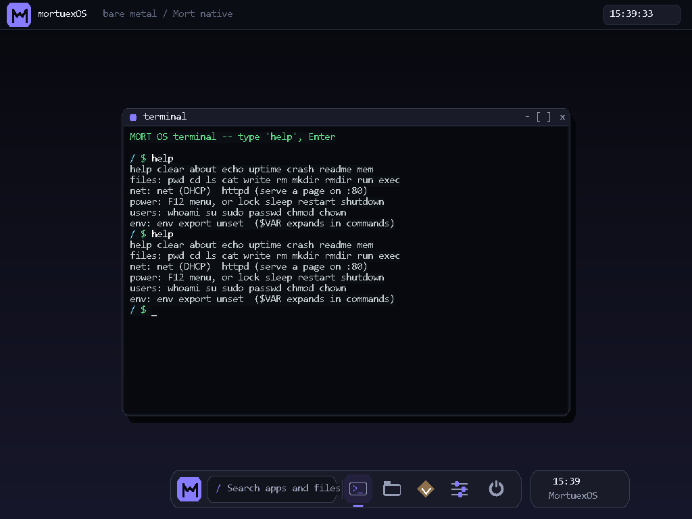

# qemu-mcp

**Let your AI agent boot an operating system and drive it.**

qemu-mcp is an [MCP](https://modelcontextprotocol.io) server that gives AI agents (Claude Code, or any MCP client) hands on a QEMU virtual machine: boot an ISO or a raw kernel, press keys, take screenshots, read the serial console, and wait for boot markers — all headless, with **zero cooperation from the guest**. No SSH, no guest agent, no network. If it boots in QEMU, an agent can drive it.

<p align="center">
  
</p>

*This screenshot was taken by an AI agent: it booted [MORT OS](https://github.com/0xmortuex/MortOS) (a hobby kernel with no SSH, no agent, no TCP required) headless, pressed `Esc`, typed `help`, and captured the framebuffer — four tool calls.*

## Who this is for

**OS developers and hobby kernel hackers.** The osdev inner loop is: edit kernel → build → boot in QEMU → *look at the screen* → type something → read serial → repeat. An AI agent can already do the edit and build steps; qemu-mcp gives it the rest of the loop, so it can boot-test its own kernel changes and actually see the triple fault.

It's equally useful for anyone who needs an agent to poke at a VM below the OS level: bootloaders, installers, BIOS/UEFI menus, recovery consoles, firmware.

## Why another QEMU MCP server?

The existing ones assume a *full, running guest OS* — they exec commands over SSH or a guest agent. That's useless when your guest is a 40 KB kernel you wrote yourself, an installer ISO, or anything pre-boot. qemu-mcp is built for the boot-test loop instead:

- **Serial console capture** — continuously logged to a file, readable at any time (`qemu_serial`), and writable too (`qemu_serial_send`)
- **`qemu_wait_serial`** — block until `"kernel ready"` (or `"login:"`, or your panic string) appears, the reliable way to sequence an automated boot test
- **`-kernel` boot** — boot a multiboot/bzImage kernel directly, with `append`/`initrd`
- **Screenshots of the VGA framebuffer** — works headless, shows exactly what a monitor would
- **Raw QMP escape hatch** — the full QEMU Machine Protocol when you need `memsave`, `system_reset`, `device_add`…

## Tools

| Tool | What it does |
|------|--------------|
| `qemu_boot` | Boot a VM headless from `iso`, `kernel` (+`append`/`initrd`), and/or `disk`. Any arch QEMU supports (`x86_64`, `i386`, `aarch64`, `riscv64`…), an optional `machine` (QEMU `-M`, required on some archs), arbitrary extra QEMU args (networking, devices…), and overridable `qmp_connect_timeout_s`/`qmp_read_timeout_s` for slow hosts or long-running QMP commands |
| `qemu_screenshot` | PNG of the guest's display, straight from the framebuffer |
| `qemu_type` | Type text as keyboard input (`\n` = Enter, shifted symbols handled, tunable keystroke delay) |
| `qemu_key` | Press a key or chord: `enter`, `esc`, `f12`, `ctrl-alt-f2`… |
| `qemu_mouse` | Move the absolute pointer (fractions of screen width/height) and optionally click `left`/`right`/`middle` |
| `qemu_snapshot_save` | Save a full RAM+device snapshot under a tag (needs a qcow2 disk). Reports failure if QEMU's savevm rejects it (e.g. a raw disk) instead of claiming success |
| `qemu_snapshot_load` | Restore a VM to a previously saved snapshot tag. Reports failure if QEMU's loadvm rejects it (e.g. an unknown tag) instead of claiming success |
| `qemu_serial` | Tail the serial console (COM1) output — works after the VM has exited too, to see what it printed right before dying |
| `qemu_serial_send` | Write text to the serial console (COM1) |
| `qemu_wait_serial` | Block until given text appears on serial, or timeout |
| `qemu_wait_screen` | Block until the display stops changing (for VGA-only guests with no serial output), or timeout |
| `qemu_list` | All managed VMs with state, arch, machine, pid, uptime |
| `qemu_stop` | Graceful ACPI powerdown, or `force=true` to kill |
| `qemu_qmp` | Run any raw QMP command on the VM |

Multiple named VMs can run at once.

## Install

Requirements: Python 3.10+, and [QEMU](https://www.qemu.org/download/) on your PATH (on Windows, `C:\Program Files\qemu` is found automatically, or set `QEMU_DIR`).

```bash
pip install git+https://github.com/0xmortuex/qemu-mcp
```

**Claude Code:**

```bash
claude mcp add qemu -- qemu-mcp
```

**Any other MCP client** (stdio transport):

```json
{
  "mcpServers": {
    "qemu": {
      "command": "qemu-mcp"
    }
  }
}
```

Or without installing, via [uv](https://docs.astral.sh/uv/): `claude mcp add qemu -- uvx --from git+https://github.com/0xmortuex/qemu-mcp qemu-mcp`

## Example session

> **you:** boot build/os.iso and check the shell works
>
> **agent:** `qemu_boot(name="test", iso="build/os.iso", arch="i386")` → booted
> `qemu_wait_serial(name="test", text="boot ok")` → FOUND
> `qemu_type(name="test", text="help\n")`
> `qemu_screenshot(name="test")` → *sees the help output rendered*
> `qemu_stop(name="test", force=true)`
> "Your ISO boots, the shell responds to `help`, and the new command is listed. Screenshot attached."

A typical kernel test the agent can run by itself:

```
qemu_boot(name="k", kernel="build/kernel.elf", arch="i386",
          extra_args="-device rtl8139,netdev=n0 -netdev user,id=n0")
qemu_wait_serial(name="k", text="MORTNET READY", timeout_s=20)
qemu_serial_send(name="k", text="net\n")  # guest has no keyboard driver, only a serial shell
qemu_serial(name="k")          # did DHCP bind?
qemu_screenshot(name="k")      # what does the console show?
```

### Non-x86 archs

`x86_64` and `i386` boot with no `machine` argument. Other archs have no
default machine in QEMU and need `-M` set explicitly, or they'll fail to
boot:

```
qemu_boot(name="a", kernel="build/kernel-aarch64.elf", arch="aarch64", machine="virt")
qemu_boot(name="r", kernel="build/kernel-riscv64.elf", arch="riscv64", machine="virt")
```

Check `qemu-system-<arch> -M help` for the full list of machines an arch supports.

## Tests

[](https://github.com/0xmortuex/qemu-mcp/actions/workflows/ci.yml)

Unit tests for the character/key-name -> QMP qcode translation in `keys.py`,
the screen-fraction -> QMP pointer-event translation in `mouse.py`, the
serial chardev args and reconnect logic in `serial.py`, the framebuffer
stability tracker in `screen.py`, the snapshot tag validation and HMP
command-line building in `snapshot.py`, the QMP client's error handling in
`qmp.py`, the missing-binary error path, and an MCP stdio handshake smoke
test all need no QEMU install - this is what CI runs on every push:

```bash
pip install -e ".[test]"
ruff check src tests
mypy --strict src
pytest tests/test_keys.py tests/test_mouse.py tests/test_screen.py tests/test_snapshot.py tests/test_serial.py tests/test_qmp.py tests/test_vm.py tests/test_stdio_handshake.py
```

There's also an end-to-end test that boots a real ISO and exercises every tool:

```bash
QEMU_MCP_TEST_ISO=path/to/anything-bootable.iso python tests/smoke_test.py
```

## Notes

- VMs run headless (`-display none`); screenshots still work because QEMU keeps rendering the VGA framebuffer.
- Serial output requires the guest to write to COM1 (most hobby kernels and all Linux `console=ttyS0` setups do). Guests that only draw to VGA are still fully drivable via screenshots + keys.
- `qemu_stop` tries ACPI powerdown first; hobby kernels usually ignore it and get killed after a grace period — use `force=true` to skip the wait.
- This server launches QEMU processes on your machine with files you point it at. `extra_args` is passed to QEMU verbatim — same trust level as running QEMU yourself.

## License

MIT
